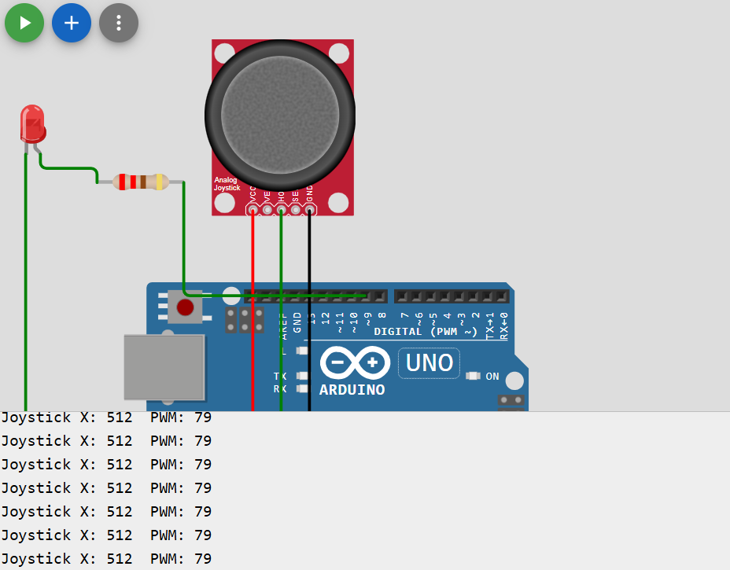

# Joystick → LED Brightness (PWM)

## Overview
In this exercise, we use the joystick **X-axis** as an input device to control the **brightness of an LED**. The Arduino reads the joystick position as an **analog value** (from **0 to 1023**) using the ADC (Analog-to-Digital Converter). Then it converts (maps) this value into a **PWM output** value (from **0 to 255**) and sends it to a PWM pin. Since PWM rapidly turns the LED on and off, the LED appears dim or bright depending on the joystick position. This is a basic embedded systems task where a sensor input controls an actuator output.

## Components Needed
- Arduino Uno (or similar)
- Joystick module
- 1 × LED
- 1 × Resistor (220Ω recommended, or 100Ω for more brightness)
- Breadboard
- Jumper wires

## Wiring / Connections

### Joystick → Arduino
- **VCC** → **5V**
- **GND** → **GND**
- **VRx** → **A0**

### LED → Arduino
- **Pin 9** → **Resistor** → **LED long leg (Anode +)**
- **LED short leg (Cathode -)** → **GND**

## Result
After uploading the code, moving the joystick **left and right** will change the LED brightness smoothly.

## Files
- `joystick_led_pwm.ino` : Arduino code
- `joystick_led_sim.png` : Wiring/simulation image

## Demo Video
🎥 Watch the PWM joystick → LED brightness demo here:  
https://youtu.be/mTZRVj2_Q8A
