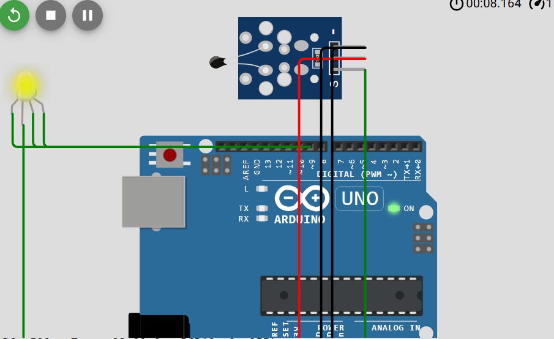

# Temperature Sensor Experiment with Arduino

This project demonstrates a simple temperature sensor experiment using an **Arduino**, a **KY-013 analog temperature sensor**, and a **KY-016 RGB LED module**.

The system reads temperature data from the sensor and changes the LED color based on the measured temperature. This project can be tested both in the **Arduino IDE** and in the **Wokwi simulation environment**.

## Components

- Arduino Uno
- KY-013 Analog Temperature Sensor
- KY-016 RGB LED Module
- Jumper wires
- Breadboard
- Arduino IDE
- Wokwi simulation

## Arduino Pin Connections

The following connections are used in the code:

### KY-013 Temperature Sensor
- `TEMP_PIN = A0`
- Sensor signal pin → **A0**
- VCC → **5V**
- GND → **GND**

### KY-016 RGB LED
- `RED_PIN = 11`
- `GREEN_PIN = 9`
- `BLUE_PIN = 10`

Connections:
- Red pin of RGB LED → **Digital Pin 11**
- Green pin of RGB LED → **Digital Pin 9**
- Blue pin of RGB LED → **Digital Pin 10**
- Common pin of RGB LED → **GND** if using **common cathode**
- Common pin of RGB LED → **5V** if using **common anode**

## Code Configuration

The [code](https://github.com/f-kuzey-edes-huyal/embedded-system-design/blob/main/week5/arduino_temperature_sensor.ino) uses the following settings:

- `COMMON_CATHODE = true`  
  This means the RGB LED is configured as **common cathode**.

- `INVERT_TEMP_DIRECTION = false`  
  If touching the sensor causes colder colors instead of warmer colors, this value can be changed to `true`.

- `TOUCH_GAIN = 20.0`  
  This increases sensitivity so that small temperature changes become easier to see.

- `NEUTRAL_BAND = 1`  
  This defines a small neutral temperature zone around room temperature.

## Project Idea

The main purpose of this experiment is to observe how temperature changes can be represented visually with different LED colors.

- Lower temperature values can be shown with **blue**
- Medium values can be shown with **green** or transition colors
- Higher temperature values can be shown with **red**

## Wokwi Simulation

The following image shows the Wokwi simulation setup used in this project.

## Demo Video

[Watch the demo video](https://www.youtube.com/shorts/_HXoZ0HnQLw)
