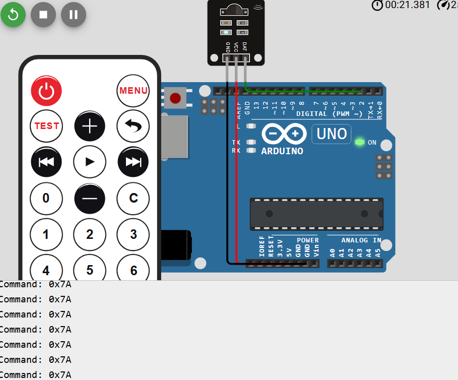
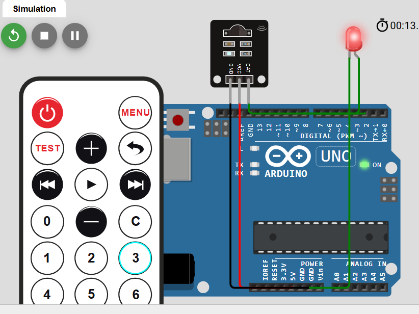

# IR Remote Controlled LED with KY-022 and Arduino

This experiment shows how to use an **IR remote**, a **KY-022 IR receiver**, and an **LED** with Arduino.  
First, we test the remote and learn the button code. Then, we use that code to control the LED.

---

## Project Goal

The goal of this experiment is to understand how an embedded system:

- reads an input signal
- decodes communication data
- makes a logical decision
- controls an output device


---

## Components

- Arduino board
- KY-022 IR receiver
- IR remote control
- LED
- 220Ω resistor
- Breadboard
- Jumper cables

---

## Cable Connections

### KY-022 IR Receiver

The KY-022 module has three pins:

- **S** → Arduino **D2**
- **-** → Arduino **GND**
- **middle pin** → Arduino **5V**

### LED Connections

- Arduino **D8** → **220Ω resistor** → **LED long leg**
- **LED short leg** → **GND**

---

## How the IR Receiver Works

The **KY-022 IR receiver** detects infrared light signals sent by the remote control.  
When we press a remote button, the remote sends a coded infrared signal.  
The receiver captures this signal and sends it to the Arduino as digital information.

The Arduino then decodes the signal and reads values such as:

- **Protocol**
- **Address**
- **Command**
  Example:

```text
Protocol=NEC Address=0x2 Command=0x13
```


---

## Wokwi Simulation - Learning Hex Code

This screenshot shows the Wokwi simulation step where we test the IR remote and read the button's hexadecimal command from the Serial Monitor.



## Wokwi Simulation - Lighting the LED

This screenshot shows the final stage of the Wokwi simulation, where the selected remote button controls the LED.



