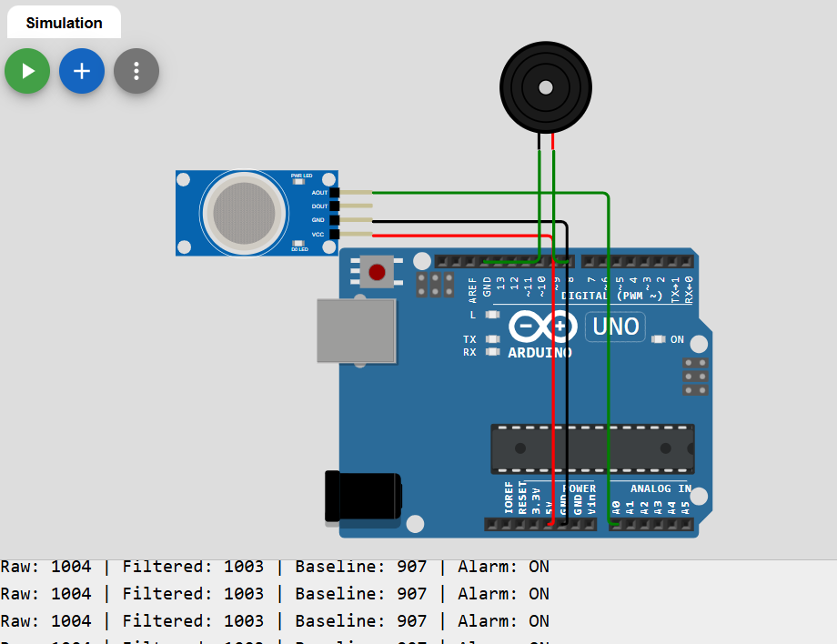

# Gas Sensor Alarm System with Arduino

This project demonstrates a simple embedded systems experiment using an **MQ-2 gas sensor**, an **Arduino Uno**, and a **buzzer**. The system monitors the gas level in the environment and produces a warning sound when the detected gas concentration rises above a defined threshold.

## Project Purpose

The aim of this experiment is to build a basic gas detection and warning system. The gas sensor reads the surrounding air continuously, and the Arduino processes these readings to determine whether a gas leak or strong vapor, such as cologne or alcohol-based spray, is present. If the gas level becomes too high, the buzzer generates an audible warning.

## Components Used

- Arduino Uno
- MQ-2 Gas Sensor
- Piezo Buzzer
- Jumper wires

## Circuit Connections

### MQ-2 Gas Sensor
- **VCC** → **5V**
- **GND** → **GND**
- **A0** → **A0** on Arduino

### Buzzer
- **Positive (+)** → **Digital Pin 8**
- **Negative (-)** → **GND**

## Wokwi Simulation Image

The simulation image is included in the same folder:

## How the System Works

When the Arduino starts, it first calibrates the gas sensor by taking several initial readings. These readings are averaged to create a **baseline** value, which represents the normal gas level in the environment.

During operation, the Arduino:

1. Reads the gas sensor repeatedly
2. Averages multiple sensor values
3. Applies a smoothing filter to reduce noise
4. Compares the filtered value against a threshold
5. Activates the buzzer if gas is detected
6. Stops the buzzer when the gas level returns to a safer range

This makes the system more stable than a very basic single-read threshold design.

## Code Logic Explanation

### Pin Definitions
The gas sensor is connected to analog pin **A0**, and the buzzer is connected to digital pin **8**.

### Calibration
At startup, the system reads the gas sensor multiple times to determine a baseline value. This allows the project to adapt to the normal air condition at the start of the experiment.

### Averaging and Filtering
The sensor readings may fluctuate because of noise. To improve reliability, the program:

- averages multiple readings
- applies a simple smoothing filter

This makes the gas detection more stable.

### Threshold and Hysteresis
The alarm is activated when the filtered sensor value rises above the baseline plus a fixed offset. A hysteresis value is used so that the buzzer does not rapidly switch on and off near the threshold.

### Buzzer Warning
When gas is detected, the buzzer produces a tone. As the gas level increases further above the threshold, the buzzer frequency increases. This gives a more dynamic warning signal.

