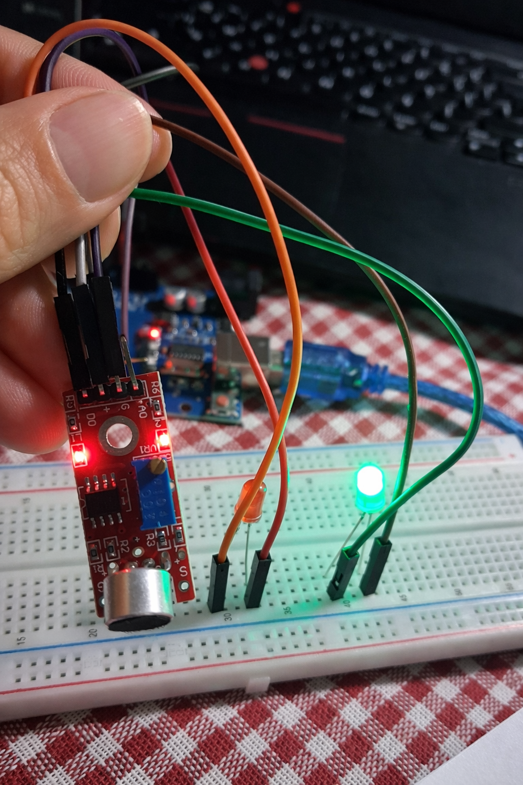

# KY-037 Sound Sensor and Two-LED Arduino Experiment

This project demonstrates a simple **embedded systems experiment** using the **KY-037 sound sensor**, **Arduino**, and **two LEDs**.

The experiment is designed in two levels:

- **Basic experiment**: simple sound-triggered LED response
- **Mid-level experiment**: improved embedded systems design with states, timing, and debouncing

It can be implemented on **real hardware** and also adapted for **Wokwi simulation**.

---

## 1. Aim of the Experiment

The aim of this experiment is to show how an embedded system reacts to a real-world sound event.

In this setup:

- the **sound sensor** detects input from the environment,
- the **Arduino** processes this input,
- the **LEDs** show the output behavior of the system.

This demonstrates the basic embedded systems logic:

**Sense -> Decide -> Act**

So, the experiment is not only about blinking LEDs. It is about understanding how an embedded system reads an input, makes a decision, and produces an output.

---

## 2. Components

- Arduino Uno
- KY-037 sound sensor
- 1 green LED
- 1 red LED
- 2 resistors
- Breadboard
- Jumper wires

### For Wokwi
In Wokwi, the sound trigger may be represented by a **pushbutton** instead of the real KY-037 sound sensor.

---

## 3. Basic Experiment

### Description
In the basic version:

- the **green LED** is normally ON,
- the **red LED** is normally OFF,
- when sound is detected, the system enters alert mode,
- the **green LED turns OFF**,
- the **red LED turns ON** for a short time,
- then the system returns to the normal state.

### What students learn
- digital input reading
- digital output control
- event detection
- simple timing logic
- basic embedded systems flow

### Educational purpose
This version is useful for introducing beginners to a simple **reactive embedded system**.

---

## 4. Mid-Level Experiment

### Description
In the mid-level version, the system is more structured.

The system has two operating states:

- **ARMED**
- **ALERT**

In **ARMED** mode:
- green LED is ON
- the system waits for sound

In **ALERT** mode:
- green LED is OFF
- red LED blinks
- after a defined time, the system returns to ARMED mode

### What students learn
- state-based design
- modular code structure
- non-blocking timing with `millis()`
- debouncing
- improved embedded systems architecture

### Educational purpose
This version is more suitable for showing how real embedded systems are designed in a structured and reliable way.

---

## 5. Difference Between the Two Experiments

### Basic experiment
- simpler logic
- direct reaction to sound
- easier for beginners
- limited structure

### Mid-level experiment
- state-based design
- better organized code
- more realistic timing control
- more robust behavior
- closer to real embedded systems design

## 6. Sound Sensor Explanation

The **KY-037** is a sound detection module.

It can provide:

- **digital output** for threshold-based detection
- **analog output** for continuous signal reading

In this experiment, the sensor acts as the **input** of the embedded system.

The Arduino reads the sensor signal and controls the LEDs according to the program logic.

---

## 7. Why Debouncing is Important

In real systems, one physical event may not produce one perfectly clean signal.

A sensor or button may create several fast unwanted changes in a very short time.

This can make the Arduino think that one event happened many times.

**Debouncing** is used to avoid this problem.

It helps the system count one real event only once and makes the experiment more stable and reliable.

---

## 8. Why `millis()` is Used

In the improved version, `millis()` is used instead of long `delay()` calls.

This is important because:

- the system remains responsive,
- the microcontroller can continue checking the sensor,
- timing control becomes more realistic for embedded systems.

Using `millis()` is a better design approach for systems that need to handle multiple tasks.

---

## KY-037 Sound Sensor and LED Circuit

