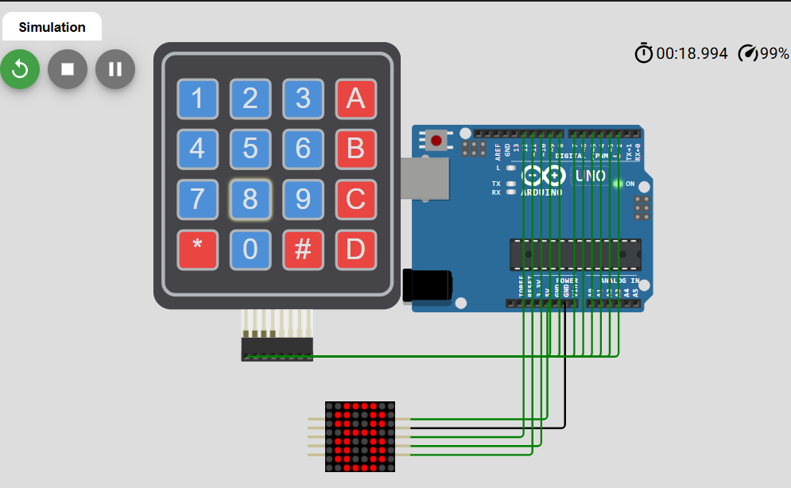

# Keypad to MAX7219 Character Display Experiment

## Overview
This experiment demonstrates how a **4x4 membrane keypad** can be used as an input device and how the pressed key can be displayed on an **8x8 LED matrix driven by the MAX7219 module**.  
When the user presses a key on the keypad, the Arduino reads the input and shows the corresponding number, letter, or symbol on the LED matrix.


---

## Components Used

- Arduino Uno
- 4x4 Membrane Keypad
- MAX7219 8x8 LED Matrix Module
- Jumper wires
- Wokwi simulation environment

---

## Objective
The main objective of this experiment is to:

- detect keypad button presses
- map each pressed key to a predefined 8x8 pattern
- display that pattern on the MAX7219 LED matrix
- print the pressed key to the Serial Monitor

---

## Pin Connections

### MAX7219 Module to Arduino Uno
| MAX7219 Pin | Arduino Uno Pin |
|---|---|
| V+ | 5V |
| GND | GND |
| DIN | 12 |
| CS | 10 |
| CLK | 11 |

### Keypad to Arduino Uno
| Keypad Pin | Arduino Uno Pin |
|---|---|
| C1 | 5 |
| C2 | 4 |
| C3 | 3 |
| C4 | 2 |
| R1 | 9 |
| R2 | 8 |
| R3 | 7 |
| R4 | 6 |

---

## How the Experiment Works

1. The Arduino continuously scans the keypad.
2. When a key is pressed, the program detects the character.
3. A matching 8x8 bitmap pattern is selected.
4. That pattern is sent to the MAX7219 matrix.
5. The same pressed key is also printed to the Serial Monitor.

### Example behavior
- Press `1` → the matrix shows `1`
- Press `A` → the matrix shows `A`
- Press `#` → the matrix shows `#`
- Press `*` → the matrix is cleared

---

## Notes About the Display
During testing, the characters may appear mirrored depending on the matrix orientation.  
This is solved in the code by reversing the bits before displaying each row.

So the experiment also helps students understand that:

- software and hardware orientation must match
- display modules may require bit or row adjustments
- debugging output in Serial Monitor is very useful

---

## Files in This Experiment

| File Name | Description |
|---|---|
| `keypad_max7219_character_display.ino` | Arduino code for reading keypad input and displaying characters on the MAX7219 matrix |
| `diagram.json` | Wokwi circuit connections for Arduino Uno, keypad, and MAX7219 |
| `README.md` | Documentation for the experiment |

---


## Expected Output

| Input from Keypad | Output on MAX7219 Matrix |
|---|---|
| `1` | Character `1` |
| `A` | Character `A` |
| `0` | Character `0` |
| `#` | Symbol `#` |
| `*` | Clear display |

Also, the Serial Monitor prints messages such as:

```text
Pressed: 1
Pressed: A
Pressed: #
```

---
## Wokwi Experiment Screenshot

The following image shows the Wokwi simulation of the keypad and MAX7219 character display experiment.


